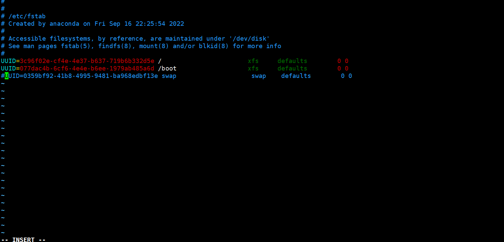

# linux设置桌面安装
# linux设置桌面卸载
# 关闭swap
# 设置

## 安装桌面
- 查看当前的运行级别和可以安装的group
```bash
systemctl get-default
yum grouplist
```
- 查看安装的包有哪些内容
```bash
yum group info  "Graphical Administration Tools"
 
```
- 安装GNOME桌面
```bash
yum -y groups install "GNOME DESKTOP" "Graphical Administration Tools" 
```
- 安装成功后，设置开机启动为GNOME
```bash
systemctl set-default graphical.target
reboot
```

## 卸载桌面
- 卸载GNOME桌面
```bash
yum groups remove -y "GNOME Desktop" "Graphical Administration Tools"
```
- 卸载其他Gnome相关软件
```bash
yum remove -y gnome* 
```
- 设置开机启动为多用户状态
```bash
systemctl set-default multi-user.target
reboot
```

## 关闭swap
- 临时关闭,开启
```bash
swapoff --version 
swapon -a
```
- 永久关闭
```bash
vim /etc/fstab 
```
注释掉swap行  


## selinux
- 关闭SELinux
```bash
vi /etc/selinux/config
```
将文件中的SELINUX="" 为 disabled ，然后重启。
如果不想重启系统，使用命令setenforce 0注：setenforce 1 设置SELinux 成为enforcing模式
setenforce 0 设置SELinux 成为permissive模式