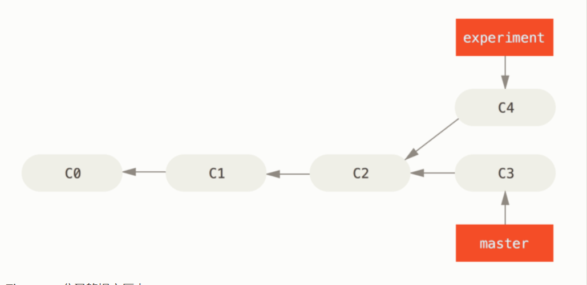
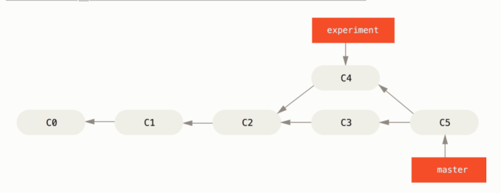
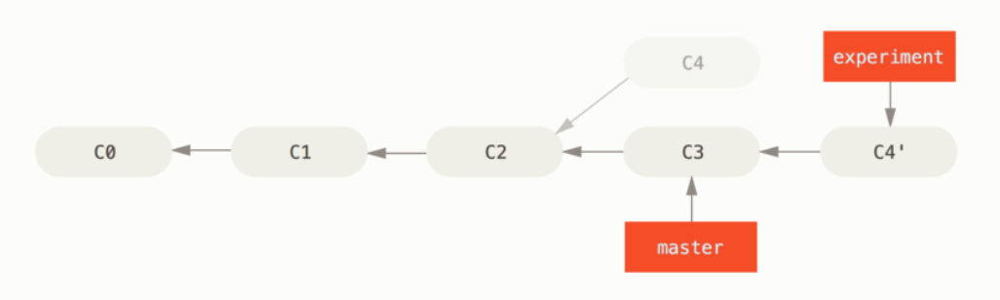
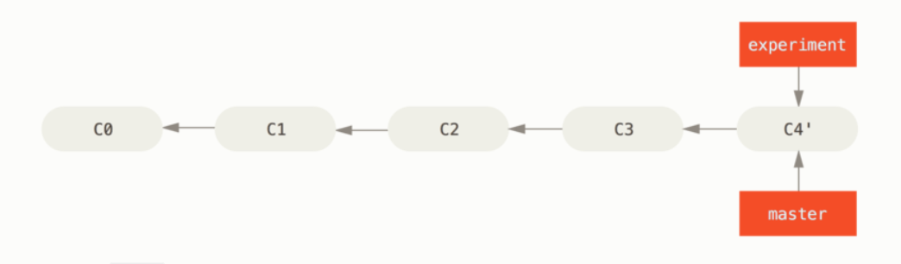
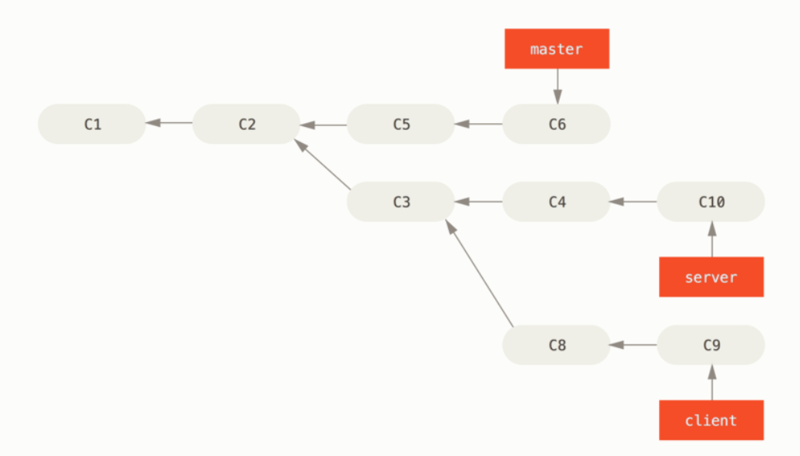

# Git
- 什么是git子模块（Submodule）子模块
- git命令

## 1. 什么是git子模块
- 子模块允许您将 Git 存储库保留为另一个 Git 存储库的子目录。 这使您可以将另一个存储库克隆到您的项目中并保持您的提交分开。 
### 1.1 添加子模块
- 在现有仓库基础之上执行命令。
```bash
  git submodule add ${submodule.uri}
```
会发现主目录（对应子模块目录上级或者说根目录）生成一个.gitmodules配置文件，里面有子模块对应的相关信息。
同时，git不会跟踪对应子模块的更改。
### 1.2 git clone 带有子模块项目
- clone 只能得到对应子模块的文件夹，里面没有任何文件
- 通过一下命令得到对应完整文件
```bash
初始化您的本地配置文件  
git submodule init  
从该项目中获取所有数据并检查您的超级项目中列出的相应提交  
git submodule update
要初始化,获取和签出任何嵌套的子模块
git submodule update --init --recursive
```
- --recurse-submodules 克隆项目同时克隆子模块项目
```bash
git clone --recurse-submodules ${git.url}
```
### 1.3 子模块更新
- 如果要检查子模块中的新工作，可以进入目录并运行git fetch和git merge上游分支以更新本地代码。
- git pull = git fetch  + git merge
- 如果您不想在子目录中手动获取和合并。 
```
git submodule update --remote
```
此命令将假定您要将检出更新到远程子模块存储库的默认分支（远程指向的分支HEAD）。 但是，您可以根据需要将其设置为不同的值
```bash
git config -f .gitmodules submodule.{submodule.name}.branch stable
```
### 1.4 子模块问题
- 当我们运行git submodule update命令从子模块存储库中获取更改时，Git 将获取更改并更新子目录中的文件，但会使子存储库处于所谓的“分离 HEAD”状态
```
 1.切换到子模块目录执行 
 git checkout ${branch.name}
 2.切换回到刚才主目录执行
 git submodule update --remote --merge|--rebase ${submodule.name} （${submodule.name} 存在多个子模块带上对应名称,否则可以忽略）
 3.注意：这里是将远程的分支和本地新建的分支进行合并，之后的拉取项目必须带上 --meger 或者 --rebase,否则还会出现分离现象。
 当我们在子模块工作区间进行提交之后，忘记了（--merge , --rebase）
 忘记也没有关系，这里切换到子模块对应目录，你刚才生成的分支依然存在,
 执行: git checkout ${branch.name}
 返回主目录重新进行meger和rebase操作。
```
## 2. git命令使用
### 2.1 设着邮箱和用户名
- global代表全局，不加global代表当前项目
```bash
git config --global user.name "Your name"
git config --global user.email "email@example.com"
```
### 2.2 git存储区域提交和回退
工作区：对应的目录  
版本库：.git  
版本库分为：暂存区和分支，添加到暂存区的数据要提交到分支中才能最终提交到git  
git相关命令：工作区内->暂存区->分支  
git add filename：添加文件到暂存区  
git commit -m "info" 提交更改分支  
git status： 查看仓库的当前状态  
git diff:  比较的是工作区和暂存区的差别  
git diff --cached 比较的是暂存区和版本库的差别  
git diff HEAD 可以查看工作区和版本库的差别  
git log：查看历史记录   
git log --pretty=oneline 以id查看历史记录  
git reflog 记录每次命令  
git checkout --file 文件没有经过添加到暂存区的恢复  
git reset HEAD file 可以将暂存区的文件修改撤销  再通过checkout 回退到版本库     
git reset --hard HEAD^或者直接通过id（--hard 3628164）  版本回退 git reset  
git fetch ${branch.name} && git merge ${branch.name}/${local.branch.name} 合并远程分支数据到本地分支

### 2.3 git标签
git tag ${name} 打标签  
git tag ${tag.name} ${commit.id} 给某个版本打标签  
git tag 查看标签  
git show ${tag.name}查看标签信息  
git tag -a ${tag.name} -m ${tag.info}  
git tag -d ${tag.name} 删除标签  
git push origin ${tag.name} 推送标签到远程仓库  
删除远程标签先删除本地
git tag -d ${tag.name}  
git push origin :refs/tags/${tag.name}  
### 2.4 登录问题
避免每次push需要登录问题
打开git bash控制终端后：  
```bash
cd ~  
vi .gitconfig  
```
在文件中加上如下：  
[credential]
helper = store –file .git-credentials 

### 2.5 git merge|git rebase 命令区别
- 两者都是用来合并分支命令。下面以图列来分析rebase和merge区别  
- 这是一个开发任务分叉到两个不同分支

- 整合分支最容易的方法是 merge 命令。 它会把两个分支的最新快照（C3 和 C4）以及二者最近的共同祖先（C2）进行三方合并，
合并的结果是生成一个新的快照（并提交）  

#### 2.5.1 下面介绍rebase使用
- 你可以提取在 C4 中引入的补丁和修改，然后在 C3 的基础上应用一次。
  即使用 rebase 命令将提交到某一分支上的所有修改都移至另一分支上，就好像“重新播放”一样。
```bash
$ git checkout experiment
$ git rebase master
First, rewinding head to replay your work on top of it...
Applying: added staged command
```
- 它的原理是首先找到这两个分支（即当前分支 experiment、rebase操作的目标基底分支 master） 的最近共同祖先 C2，
然后对比当前分支相对于该祖先的历次提交，提取相应的修改并存为临时文件， 然后将当前分支指向目标基底 C3, 
最后以此将之前另存为临时文件的修改依序应用。 

- 将 C4 中的修改变基到 C3 上 ,现在回到 master 分支，进行一次快进合并
```bash
$ git checkout master
$ git merge experiment
```


- rebase想对merge而言提交的日志记录比较整洁。

#### 2.5.2 有趣的rebase操作
- 想象一下现在你有这样的一个工作分支情形

- 现在你不想合并server分支上的工作内容，但是想把client（即 C8 和 C9）分支合并到master分支。
```bash
git rebase --onto master server client
```
- 取出 client 分支，找出它从 server 分支分歧之后的补丁， 然后把这些补丁在 master 分支上重放一遍
让 client 看起来像直接基于 master 修改一样”。这理解起来有一点复杂，不过效果非常酷。
- 再合并分支
```bash
$ git checkout master
$ git merge client
```
#### 2.5.4 直接合并rebase
- 使用 git rebase <basebranch> <topicbranch> 命令可以直接将主题分支 （即本例中的 server）变基到目标分支（即 master）上。 
这样做能省去你先切换到 server 分支，再对其执行变基命令的多个步骤。
```bash
$ git rebase master server
```
- 该命令会切换到server分支，之后需要切换到master分支进行合并
```bash
$ git checkout master
$ git merge server
```
### 2.6 删除分支命令
```bash
$ git branch -d client
$ git branch -d server
```


