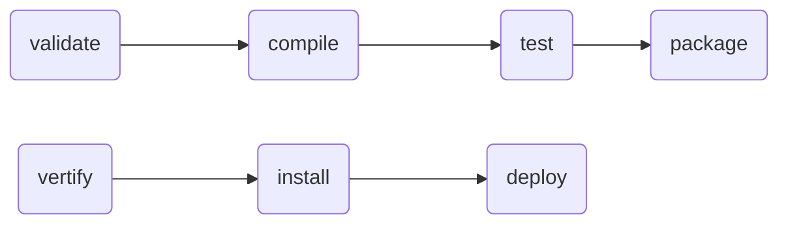

# Maven知识梳理
- 介绍
- 依赖管理加载jar的流程
- 常用的setting.xml,pom文件配置和使用
- maven的构建

## 什么是Maven？
Maven是一个项目管理工具，可以对Java,C#,Python等语言编写的项目进行构建，依赖管理等等，
基于对象模型（POM）概念。

下载地址[Apache　Maven](https://maven.apache.org/download.cgi)
这里不再阐述他的环境配置可以看我之前的文档[环境配置](https://cherubr.github.io/categories/Environment)
,主要针对pom文件，setting.xml文件进行一些说明。

## 依赖管理加载jar的流程
首先你要了解maven加载jar的一些配置  
### localRepository,Profiles，（pom中的repositories），Mirrors
- localRepository(所有使用了此setting.xml文件的项目)  
项目默认从本地仓库寻找存在的依赖jar，`优先级最大`
- Profiles  
Profiles中存在Profile元素下的Repositories中配置的远程仓库该仓库需要profile中配置启用了该配置属性才生效，  
setting.xml中profile生效时，会覆盖掉pom中配置了相同id的profile文件配置。`优先级<localRepository`  
```
<profiles>
  <profile>
  <!--构建配置的唯一id，用于命令行参数配置激活｀mvn test -Psupconit_office｀，
   |或者在ＡctiveProfiles中配置激活 
   |<ActiveProfiles>
   |  <activeProfile>supconit_office</activeProfile>
   |</ActiveProfiles>
   |
  -->
  <id>supconit_office</id>
  <!--该配置文件生效的变量-->
      <activation>
      　　<!--pom或者ｓｅｔｔｉｎｇ设置了对应的变量
      　　(key,value)<nexus-name>office</nexus-name>
         其它如检测系统，jdk等
         <jdk>jdk1.0</jdk>
         <os>
         <name>linxu</linux>
         <arch>x64</arch>
         <version>5.11.0-36-generic</version>
         </os>
      　　-->
         <properties>
         　　　<name>nexus-name</name>
         　　　<value>office</value>
         </properties>
      </activation>
      <!--仓库配置-->
      <repositories>
        <repository>
          <id>supconit_office</id>
          <url>http://daryu.supconit.com/nexus/repository/maven-public/</url>
          <!--启用发布版本-->
          <releases>
            <enabled>true</enabled>
          </releases>
           <!--启用开发快照-->
          <snapshots>
            <enabled>true</enabled>
          </snapshots>
        </repository>
      </repositories>
    </profile>
  </profiles>  
```
- pom(repositories)  
扩展远程仓库的配置，和profile中的repositories配置相同，默认使用的是中央仓库 ID```<id>central</id>```在pom-4.0.0.xml文件配置`优先级低于profiles`

- Mirrors  
mirrors是一个仓库的镜像代理，它存在的作用是当前你访问某一个仓库网络网速慢或者其他原因导致无法访问的时候，
　　可以使用该镜像去拉取对应的jar，本身并不是一个正在意义上的仓库配置。一旦配置必定会使用
```
  <mirror>
      <id>aliyunmaven</id>
      <mirrorOf>central</mirrorOf>
      <name>阿里云公共仓库</name>
      <url>https://maven.aliyun.com/repository/public</url>
    </mirror>
    这里主要说明一下mirrorOf这个属性，这个用来配置对应镜像使用过滤或者说是匹配原则
    * 匹配你所有配置的仓库都会走这个镜像
    !central 匹配对应不走该镜像的仓库
    组合使用时用逗号隔开。
    这里也解释一下（maven）代理使用
     <proxy>
      <id>clash</id>
      <active>true</active>
      <protocol>http</protocol>
      <host>127.0.0.1</host>
      <port>7890</port>
      <nonProxyHosts>http://maven.aliyun.com|http://daryu.supconit.com|http://miniweb.top|http://hc.supconit.com</nonProxyHosts>
    </proxy>
    <nonProxyHosts> 这个配置说明那些不走代理用｜隔开
```

## maven构建过程
### 生命周期

第一行代表前面是项目构建
第二行代表项目校验，测试，安装，发布过程
mvn install 安装jar包，或将自己的jar放入本地仓库
mvn deploy 发布已经安装的包。
这里主要说明一下deploy过程在pom中配置项
```
<distributionManagement>
    <repository>
      <id>supconit-releases</id>
      <url>http://daryu.supconit.com/nexus/repository/maven-public/</url>
    </repository>
    <snapshotRepository>
     <id>supconit-snapshots</id>
     <url>http://daryu.supconit.com/nexus/repository/maven-snapshots</url>
    </snapshotRepository>
</distributionManagement>
```


